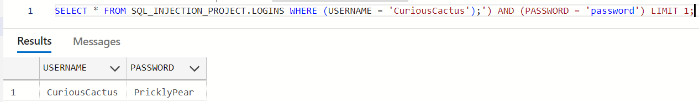
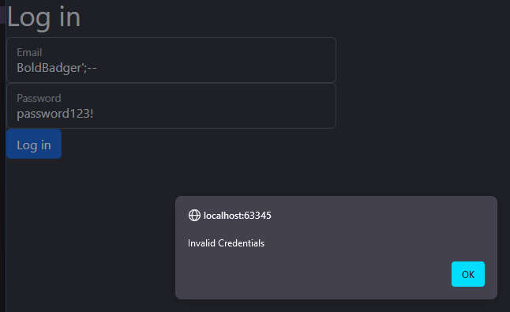
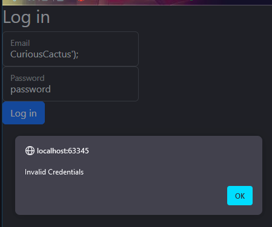
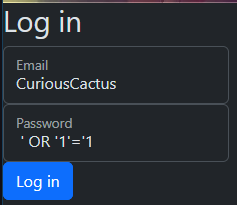

# SQL_Injection_Prevention_Proj
IT241 Project 2 - SQL Injection vulnerabilities and protections via PHP.

# README

# **SQL Injection and Prevention**

---

### Description

- This application demonstrates two identical log in pages, with different backing code.
    - [MainProtected.php](https://github.com/kcraycraft45/SQL_Injection_Prevention_Proj/blob/main/MainProtected.php) protects inputs from SQL injection using PDO, which you may read more about in the [ResearchPaper.pdf](https://github.com/kcraycraft45/SQL_Injection_Prevention_Proj/blob/main/ResearchPaper.pdf).
    - [MainUnprotected.php](https://github.com/kcraycraft45/SQL_Injection_Prevention_Proj/blob/main/MainUnprotected.php) takes user input directly into SQL Queries, allowing opportunities for malicious code injection.

---

### Visuals

SQL Injection Command Success in Azure

SQL Injection Failure in MainUnprotected.php

SQL Injection Failure #2 in MainUnprotected.php

---

### Configuration

1. To run this code, your php.ini file must include the line `extension=php_pdo_mysql` where your extensions lie.
2. Next, using a combination of Docker Desktop and Azure with the MySQL extensions installed, create your schema using the commands saved in [CreatingLoginsTable.sql](https://github.com/kcraycraft45/SQL_Injection_Prevention_Proj/blob/main/CreatingLoginsTable.sql).
3. Change your database connections in both the [MainProtected.php](https://github.com/kcraycraft45/SQL_Injection_Prevention_Proj/blob/main/MainProtected.php) and [MainUnprotected.php](https://github.com/kcraycraft45/SQL_Injection_Prevention_Proj/blob/main/MainUnprotected.php) to match the log in and database information you may be using.
4. Now you may run the code.

---

### Usage

Due to built in protections in PHP, the hacking techniques available to us are much more limited than they used to be. In this particular project, you can see two pages, one protected and one unprotected. Running the protected example yields you no opportunities to falsify valid logins.

In [MainUnprotected.php](https://github.com/kcraycraft45/SQL_Injection_Prevention_Proj/blob/main/MainUnprotected.php), logging in using wildcard characters or `’ OR ‘1’=’1` yields valid logins. This page is a blank slate for an input that is parsed into a SQL query. It took me an entire week to get it written poorly enough to accept the command listed above. I believe there are other ways of hacking in, but do not know any more that work! 

Unfortunately, many commands that yield valid results using Azure, don’t inside of the program, instead throwing syntax errors for code that should be commented out.

SUCCESSFUL MALICIOUS INJECTION

---

### Support

[kcraycraft45@southhills.edu](mailto:kcraycraft45@southhills.edu)

[rhenninger61@southhills.edu](mailto:rhenninger61@southhills.edu)

---

### Authors and Acknowledgement

- Kaci Craycraft, [kcraycraft45](https://github.com/kcraycraft45)
- Rachel Henninger, [rhenninger61](https://github.com/rhenninger61)